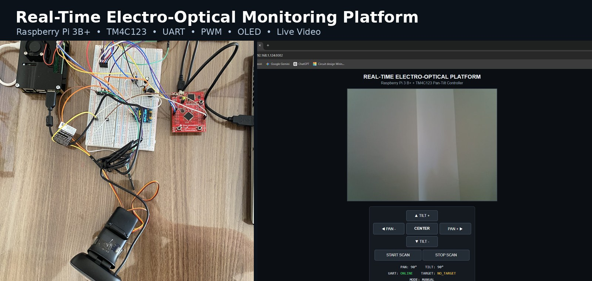
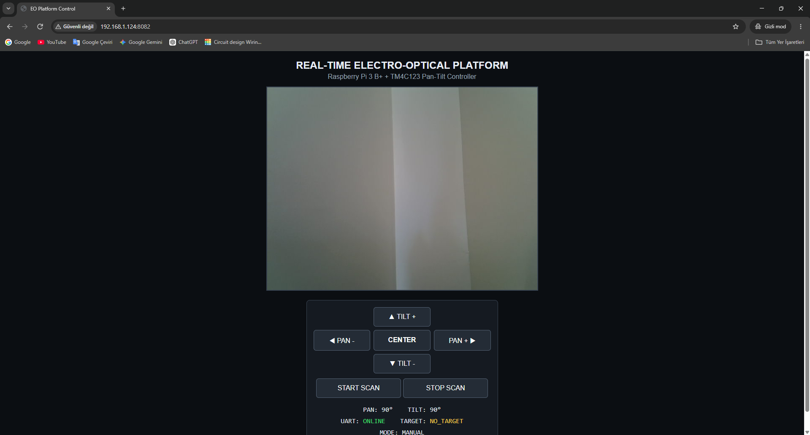
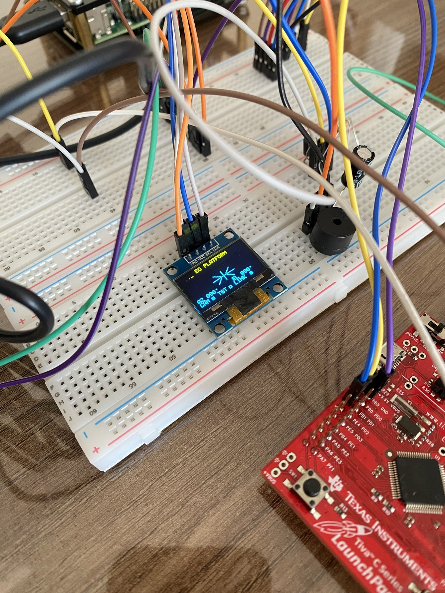
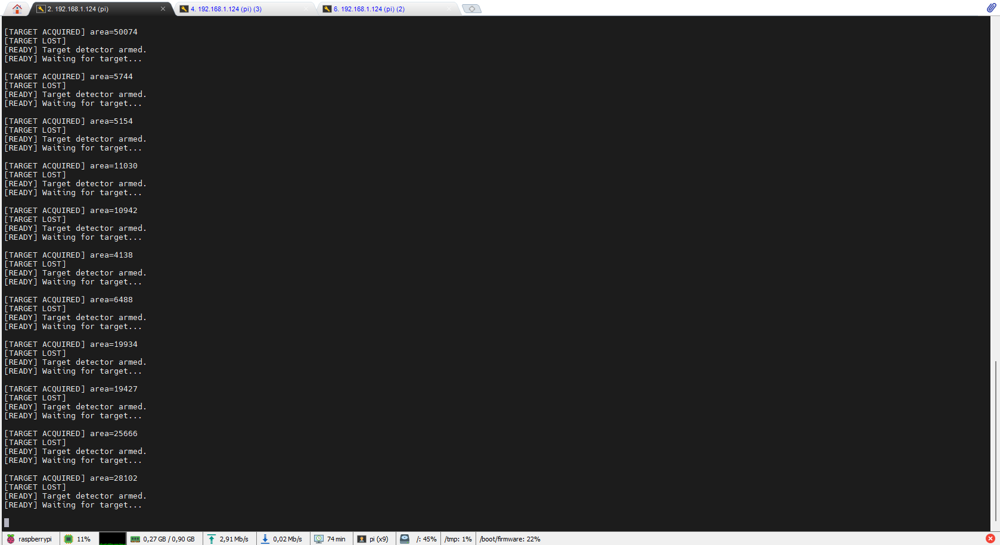
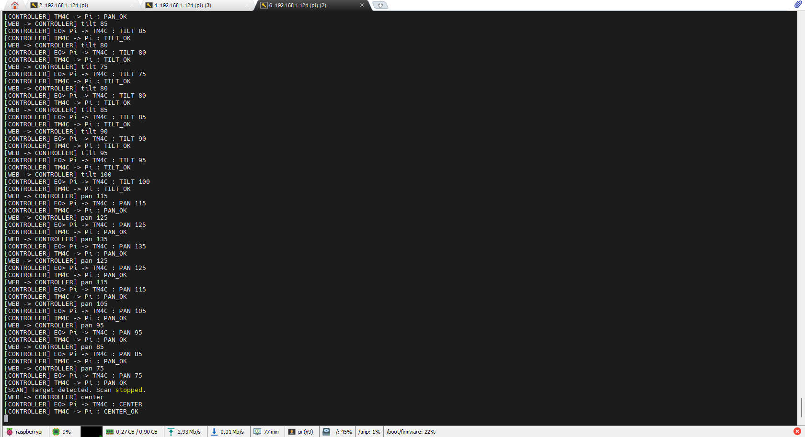
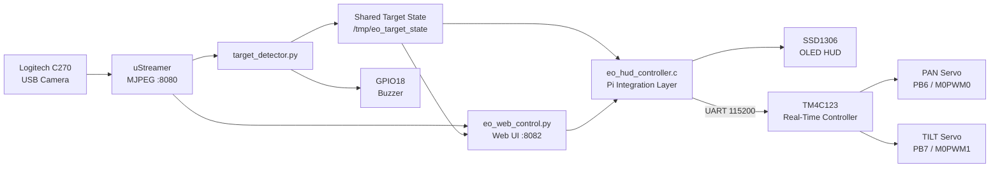

<p align="center">
  
</p>

<h1 align="center">Real-Time Electro-Optical Monitoring Platform</h1>

<p align="center">
  Embedded vision, pan-tilt control and telemetry built with Raspberry Pi 3B+ and TM4C123
</p>

<p align="center">
  <a href="https://github.com/YigitalpDellal/Real-Time-Electro-Optical-Platform/actions/workflows/ci.yml">
    
  </a>
  
  
  
  \n  
</p>

<p align="center">
  <a href="#demo">Demo</a> ·
  <a href="#visual-overview">Visual Overview</a> ·
  <a href="#system-architecture">Architecture</a> ·
  <a href="#core-capabilities">Capabilities</a> ·
  <a href="#build-and-run">Build & Run</a> ·
  <a href="docs/wiring.md">Wiring</a>
</p>

---

## Overview

This project is a network-enabled electro-optical monitoring platform that combines **embedded Linux**, **microcontroller firmware**, **real-time actuator control**, **computer vision**, and a **browser-based operator interface**.

The Raspberry Pi performs video streaming, target-event detection, web control, system state handling and telemetry. The TM4C123 receives high-level motion commands over UART, validates them, and generates the PWM signals that drive the pan and tilt servos.

| Subsystem | Implementation |
|---|---|
| Linux host | Raspberry Pi 3 Model B+ |
| Real-time controller | TM4C123GXL / TM4C123GH6PM |
| Camera | Logitech C270 USB webcam |
| Actuation | 2 × MG90S servos |
| Host ↔ MCU link | UART, 115200 baud, 8-N-1 |
| Servo control | TM4C123 PWM, 50 Hz |
| Display | SSD1306-compatible 128×64 I2C OLED |
| User interface | Browser-based control panel |
| Video | MJPEG stream through uStreamer |
| Detection | Background-change target-event detector |
| Alert output | Passive buzzer on Raspberry Pi GPIO18 |

## Demo

<p align="center">
  <a href="docs/media/final_demo.mp4">
    
  </a>
</p>

<p align="center">
  <strong><a href="docs/media/final_demo.mp4">▶ Open the final end-to-end demo</a></strong>
</p>

<p align="center">
  <a href="docs/media/hardware_walkthrough.mp4">Hardware walkthrough</a> ·
  <a href="docs/media/pan_tilt_motion.mp4">Pan/Tilt motion</a> ·
  <a href="docs/media/pan_tilt_closeup.mp4">Pan/Tilt close-up</a>
</p>

## Visual Overview

<table>
  <tr>
    <td width="50%" align="center">
      <br>
      <strong>Browser Control Interface</strong><br>
      Live video, manual pan/tilt, centering, scan control and telemetry.
    </td>
    <td width="50%" align="center">
      <br>
      <strong>OLED Telemetry HUD</strong><br>
      Live azimuth, elevation, camera, target and UART-link state.
    </td>
  </tr>
  <tr>
    <td width="50%" align="center">
      <br>
      <strong>Target Event Detection</strong><br>
      Acquired/lost state transitions generated from the camera stream.
    </td>
    <td width="50%" align="center">
      <br>
      <strong>Automatic Scan Integration</strong><br>
      Scan motion stops after a confirmed target event.
    </td>
  </tr>
</table>

## System Architecture



The system is intentionally split into two control domains. Linux handles networking, video and higher-level state, while the TM4C123 owns time-sensitive actuator control. This keeps servo timing independent from Linux scheduling.

More detail: [Architecture](docs/architecture.md) · [Wiring](docs/wiring.md)

## How the System Works

| Stage | What happens |
|---|---|
| 1. Video | The C270 stream is published by uStreamer and consumed by both the browser UI and detector. |
| 2. Detection | The detector learns the empty scene, detects significant changes and publishes target state to a shared file. |
| 3. Platform control | The web layer handles manual commands and automatic scan logic, then forwards motion requests to the C integration controller. |
| 4. Real-time actuation | The C controller communicates with the TM4C123 over UART; the MCU validates angles and generates servo PWM. |
| 5. Feedback | OLED telemetry, terminal logs and buzzer tones expose system state and target events to the operator. |

## Core Capabilities

| Capability | Stable implementation |
|---|---|
| Live video | Logitech C270 MJPEG stream |
| Manual control | Browser-based PAN/TILT movement |
| Centering | Both axes return to 90° |
| Automatic scan | PAN sweeps between 45° and 135° and reverses at endpoints |
| Safety limits | PAN 45°–135°, TILT 55°–125° |
| Target events | Background-change acquisition/loss detection with debounce |
| Scan integration | Automatic scan stops after confirmed target acquisition |
| Acoustic alerts | Two short tones on acquire, one longer lower tone on loss |
| Telemetry | OLED displays AZ, EL, CAM, LINK and TGT state |
| Pi ↔ MCU protocol | UART command/acknowledgement with timeout handling |
| Servo drive | TM4C123 hardware PWM at 50 Hz |

## UART Control Protocol

| Raspberry Pi command | TM4C123 response | Purpose |
|---|---|---|
| `PING` | `ACK` | Verify UART link |
| `CENTER` | `CENTER_OK` | Return both axes to center |
| `PAN <angle>` | `PAN_OK` | Set horizontal angle |
| `TILT <angle>` | `TILT_OK` | Set vertical angle |

## Repository Layout

```text
.
├── README.md
├── RELEASE_NOTES.md
├── Makefile
├── controller/
│   └── eo_hud_controller.c
├── raspberry_pi/
│   ├── eo_web_control.py
│   ├── target_detector.py
│   └── requirements.txt
├── tm4c/
│   └── tm4c_pan_tilt_firmware.c
├── docs/
│   ├── architecture.md
│   ├── wiring.md
│   ├── troubleshooting.md
│   └── media/
├── experiments/
│   └── README.md
└── .github/workflows/
    └── ci.yml
```

## Build and Run

<details>
<summary><strong>1. Validate and build the Raspberry Pi side</strong></summary>

From the repository root:

```bash
make check
```

To build only the Linux-side C controller:

```bash
make build
```

Python dependencies are listed in:

```text
raspberry_pi/requirements.txt
```

</details>

<details>
<summary><strong>2. Start the camera stream</strong></summary>

```bash
v4l2-ctl -d /dev/video0 --set-ctrl=exposure_dynamic_framerate=0

ustreamer \
  --device=/dev/video0 \
  --resolution=640x480 \
  --desired-fps=30 \
  --format=MJPEG \
  --host=0.0.0.0 \
  --port=8080
```

</details>

<details>
<summary><strong>3. Start target detection</strong></summary>

```bash
python3 raspberry_pi/target_detector.py
```

Keep the scene stable during the initial background-learning period.

</details>

<details>
<summary><strong>4. Start web control and telemetry</strong></summary>

```bash
python3 raspberry_pi/eo_web_control.py
```

Open:

```text
http://<RASPBERRY_PI_IP>:8082/
```

</details>

## TM4C123 Firmware

<details>
<summary><strong>Firmware configuration</strong></summary>

The MCU firmware is built and flashed with Code Composer Studio and TivaWare/DriverLib.

```text
System clock : 80 MHz
UART1        : PB0 / U1RX, PB1 / U1TX
UART         : 115200 baud, 8-N-1
PAN PWM      : PB6 / M0PWM0
TILT PWM     : PB7 / M0PWM1
Servo PWM    : 50 Hz
```

Source: [tm4c/tm4c_pan_tilt_firmware.c](tm4c/tm4c_pan_tilt_firmware.c)

</details>

## Engineering Scope

This repository represents the **stable prototype**, not every experiment performed during development.

Classical OpenCV trackers including MOSSE, KCF and CSRT were evaluated, but they were kept outside the stable feature set because of tracker drift, reacquisition latency and Raspberry Pi 3 performance limits. The final implementation prioritizes deterministic motion control, operator control, automatic scanning and reliable target-event signaling.

The debugging history includes servo power instability, common-ground issues, mechanical endpoint strain, UART startup retries, queued scan commands, camera exposure changes, OLED initialization problems and background-detection false positives.

See [Troubleshooting](docs/troubleshooting.md) and [Experimental Tracking Notes](experiments/README.md).

## Known Limitation

The stable detector uses scene/background change rather than object classification. Large moving shadows or abrupt lighting changes can therefore create false target events. The demonstration uses a short stable background-learning period before target entry.

## Documentation

| Document | Contents |
|---|---|
| [Architecture](docs/architecture.md) | Software/hardware partitioning and data flow |
| [Wiring](docs/wiring.md) | Signal, power and interconnect details |
| [Troubleshooting](docs/troubleshooting.md) | Problems encountered and engineering fixes |
| [Release Notes](RELEASE_NOTES.md) | Stable feature boundary and release summary |
| [Experiments](experiments/README.md) | Tracking approaches evaluated during development |

---

<p align="center">
  <strong>Embedded Linux · TM4C123 · UART · PWM · Computer Vision · Hardware Integration</strong>
</p>
