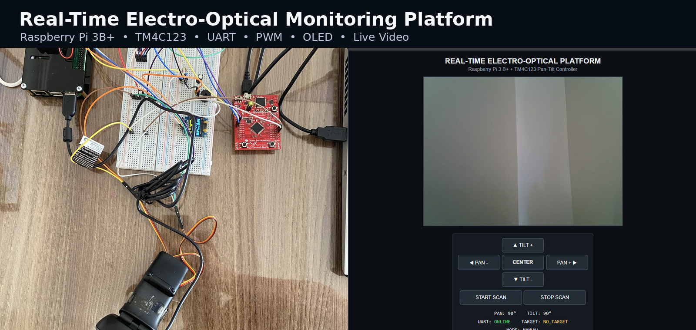
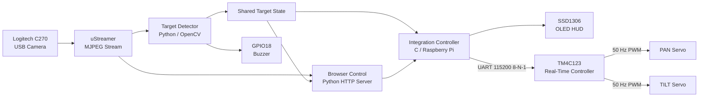
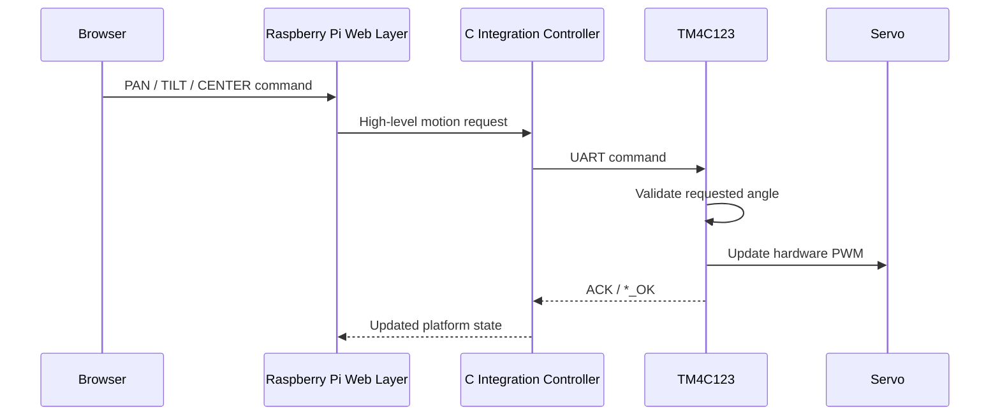
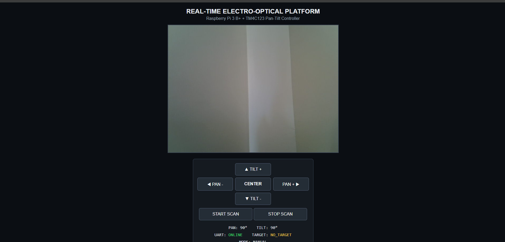
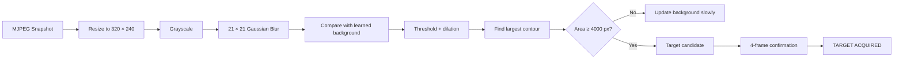
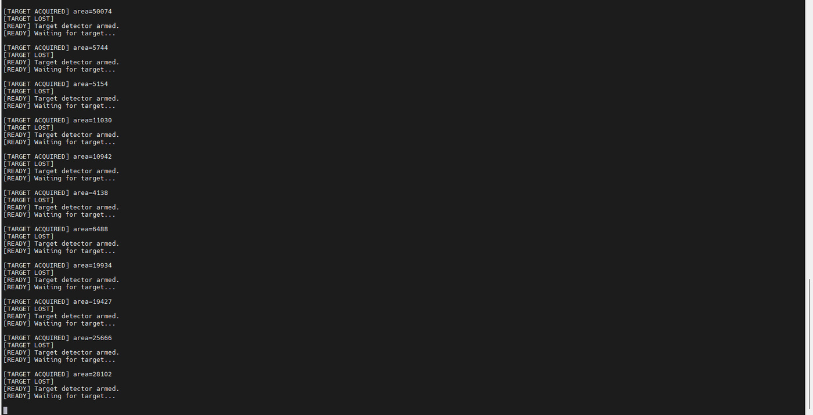
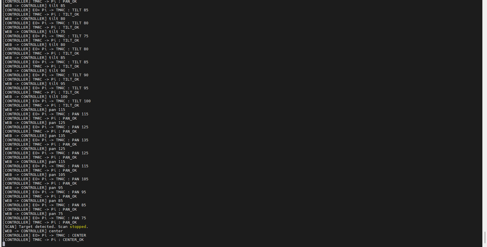

<h1 align="center">Real-Time Electro-Optical Monitoring Platform</h1>

<p align="center">
  Raspberry Pi 3B+ and TM4C123 based embedded vision, pan-tilt control and telemetry platform
</p>

<p align="center">
  <a href="https://github.com/YigitalpDellal/Real-Time-Electro-Optical-Platform/actions/workflows/ci.yml">
    
  </a>
  
  
  
  
  
  
</p>

<p align="center">
  <a href="#project-overview">Overview</a> ·
  <a href="#demonstration">Demo</a> ·
  <a href="#system-architecture">Architecture</a> ·
  <a href="#target-detection">Detection</a> ·
  <a href="#automatic-scan">Scan</a> ·
  <a href="#build-and-run">Build & Run</a> ·
  <a href="docs/wiring.md">Wiring</a>
</p>

---

<p align="center">
  
</p>

## Project Overview

This project is a complete hardware-software prototype built to apply real-time embedded systems concepts on an actual electromechanical platform.

The system combines a **Raspberry Pi 3 Model B+** with a **TM4C123GXL LaunchPad**. The Raspberry Pi handles Linux-side integration, networking, camera streaming, target-state processing and the browser interface. The TM4C123 is responsible for deterministic low-level servo actuation and hardware PWM generation.

The project is intentionally split across two computing platforms rather than asking Linux to perform every task. High-level services stay on the Raspberry Pi, while time-sensitive actuator control remains on the microcontroller.

| Subsystem | Implementation |
|---|---|
| Linux host | Raspberry Pi 3 Model B+ |
| Real-time controller | TM4C123GXL / TM4C123GH6PM |
| Camera | Logitech C270 USB webcam |
| Pan/Tilt mechanism | 2 × MG90S micro servos |
| Host ↔ MCU communication | UART, 115200 baud, 8-N-1 |
| Servo generation | TM4C123 hardware PWM, 50 Hz |
| Display | SSD1306-compatible 128×64 I2C OLED |
| Video | MJPEG stream using uStreamer |
| Operator control | Browser-based control interface |
| Detection | Lightweight background-change target detector |
| Audible feedback | Passive buzzer on Raspberry Pi GPIO18 |

## What the Prototype Demonstrates

| Area | What is implemented |
|---|---|
| **Embedded Linux** | Camera streaming, Python detection module, web server, shared system state and process integration |
| **Microcontroller firmware** | UART parser, command validation, PWM generation, servo limits and movement test logic |
| **System integration** | Raspberry Pi ↔ TM4C123 communication with acknowledgements and timeout handling |
| **Computer vision** | Background learning, motion/target confirmation, loss detection and automatic re-arming |
| **Human-machine interface** | Web controls, live telemetry and a physical OLED HUD |
| **Fault handling** | Camera retry logic, UART startup checks, range validation and mechanically safe angle limits |

---

## Demonstration

The repository includes real demonstration videos from the working prototype.

<p align="center">
  <strong><a href="docs/media/final_demo.mp4">▶ Final end-to-end demonstration</a></strong>
</p>

| Demonstration | Evidence |
|---|---|
| Complete system | [Final demo](docs/media/final_demo.mp4) |
| Physical hardware | [Hardware walkthrough](docs/media/hardware_walkthrough.mp4) |
| Pan/Tilt movement | [Motion test](docs/media/pan_tilt_motion.mp4) |
| Servo mechanism | [Pan/Tilt close-up](docs/media/pan_tilt_closeup.mp4) |

The final demo brings the separate modules together: live video, platform movement, target state, automatic scanning, UART communication, OLED telemetry and buzzer feedback.

---

## Hardware Integration

<table>
<tr>
<td width="52%" valign="top">

</td>
<td width="48%" valign="top">

### Physical platform

The hardware is built around two control domains:

**Raspberry Pi 3B+**
- USB camera acquisition
- MJPEG streaming
- target detection
- browser interface
- OLED integration
- buzzer alerts
- high-level platform state

**TM4C123**
- receives motion commands over UART
- validates requested angles
- generates 50 Hz PWM
- controls PAN and TILT servos

The servo power path uses a separate 5 V supply while all subsystems share a common ground.

</td>
</tr>
</table>

### Signal-level partitioning

```text
Raspberry Pi TX  ───────────────>  PB0 / U1RX
Raspberry Pi RX  <───────────────  PB1 / U1TX
Raspberry Pi GND ────────────────  TM4C123 / Servo GND

TM4C123 PB6 / M0PWM0 ───────────> PAN servo signal
TM4C123 PB7 / M0PWM1 ───────────> TILT servo signal

Raspberry Pi I2C-1 ─────────────> SSD1306 OLED
Raspberry Pi GPIO18 ─────────────> Passive buzzer
Logitech C270 USB ───────────────> Raspberry Pi
```

Full connection details are documented in [docs/wiring.md](docs/wiring.md).

---

## OLED Telemetry HUD

<table>
<tr>
<td width="48%" valign="top">

The OLED is not a decorative display. It reflects live platform state.

It shows:

- **AZ** — current PAN / azimuth angle
- **EL** — current TILT / elevation angle
- live PAN position pointer
- electro-optical aiming reticle
- camera state
- UART link state
- target state

The controller periodically refreshes the display so external target-state changes can become visible without blocking command handling.

</td>
<td width="52%" valign="top">

</td>
</tr>
</table>

The HUD deliberately represents **electro-optical pointing state**, not radar range. The reticle and angle scale correspond to the real pan-tilt platform.

---

## System Architecture



### Why the system is split this way

The Raspberry Pi is well suited for camera processing, networking, Linux services and the browser interface, but it is not the ideal place for timing-sensitive hobby-servo pulse generation.

For that reason, the Pi sends **high-level angle commands** while the TM4C123 owns the real servo PWM. This creates a clear separation between Linux-side orchestration and microcontroller-side actuation.

---

## End-to-End Control Flow



This acknowledgement path is important because the browser command is not treated as equivalent to physical actuation. The MCU validates the command and explicitly reports successful handling.

---

## UART Control Protocol

| Command | TM4C123 response | Function |
|---|---|---|
| `PING` | `ACK` | Verify the UART link |
| `CENTER` | `CENTER_OK` | Return both axes to 90° |
| `PAN <angle>` | `PAN_OK` | Set horizontal position |
| `TILT <angle>` | `TILT_OK` | Set vertical position |
| `TEST` | `TEST_START` / `TEST_OK` | Run the movement test |

Firmware-side error responses include:

| Response | Meaning |
|---|---|
| `RANGE` | Requested angle is outside the permitted range |
| `ERROR` | Invalid numeric format |
| `UNKNOWN` | Unsupported command |

### Safe mechanical limits

| Axis | Minimum | Center | Maximum |
|---|---:|---:|---:|
| PAN | 45° | 90° | 135° |
| TILT | 55° | 90° | 125° |

The firmware uses a wider servo calibration internally, but normal operation is deliberately restricted to these limits to prevent mechanical binding and continuous servo strain.

---

## Browser Control Layer

<p align="center">
  
</p>

The web interface provides a single operator view for:

- live camera stream
- PAN − / PAN +
- TILT − / TILT +
- automatic centering
- START SCAN / STOP SCAN
- live PAN and TILT telemetry
- UART link state
- target state
- MANUAL / SCAN operating mode

Manual movement automatically disables scan mode, preventing the automatic scan loop from fighting operator input.

The browser layer does **not** generate servo PWM. Its job is to translate operator actions into high-level requests and supervise the lower-level controller.

---

## Target Detection

The stable detector is intentionally lightweight. It performs **background-change detection**, not person identification, facial recognition or object classification.

### Processing pipeline



### Stable detector configuration

| Parameter | Value |
|---|---:|
| Processing resolution | 320 × 240 |
| Difference threshold | 25 |
| Minimum target contour | 4000 px |
| Acquisition confirmation | 4 consecutive frames |
| Target-loss confirmation | 15 frames |
| Initial background learning | 20 frames |
| Main loop delay | 0.12 s |
| Buzzer GPIO | GPIO18 |

### Target state interface

The detector publishes state through:

```text
/tmp/eo_target_state
```

States used by the platform:

```text
NO_TARGET
TARGET_ACQUIRED
TARGET_PRESENT
TARGET_LOST
OFFLINE
```

### Detection evidence

<p align="center">
  
</p>

The terminal evidence above shows repeated acquisition/loss transitions from the real detector process.

Example detector output from the working system:

```text
[READY] Target detector armed.
[READY] Waiting for target...

[TARGET ACQUIRED] area=8794
[TARGET LOST]

[READY] Target detector armed.
[READY] Waiting for target...
```

### Audible event feedback

- **Target acquired:** two short 1400 Hz tones
- **Target lost:** one longer 700 Hz tone

This makes the detection state observable even when the operator is not looking at the terminal.

---

## Automatic Scan

The web-control process contains a horizontal scan state machine.

Default scan behavior:

```text
PAN 45°  ->  55°  ->  65°  -> ... -> 135°
                                    |
                                    v
PAN 135° -> 125°  -> 115° -> ... -> 45°
```

Configuration:

| Scan setting | Value |
|---|---:|
| PAN minimum | 45° |
| PAN maximum | 135° |
| Step size | 10° |
| Step interval | 1.20 s |

The scan loop checks the detector state before commanding the next position.

When a confirmed target is reported:

```text
[SCAN] Target detected. Scan stopped.
```

the automatic scan is disabled and the mechanism remains stationary for operator control.

### Scan / UART integration evidence

<p align="center">
  
</p>

The trace shows automatic PAN commands being acknowledged by the TM4C123, followed by target-triggered scan interruption and platform recentering.

A real UART/control trace from the integrated test looked like:

```text
[WEB -> CONTROLLER] pan 115
[CONTROLLER] EO> Pi -> TM4C : PAN 115
[CONTROLLER] TM4C -> Pi : PAN_OK

[WEB -> CONTROLLER] pan 125
[CONTROLLER] EO> Pi -> TM4C : PAN 125
[CONTROLLER] TM4C -> Pi : PAN_OK

[SCAN] Target detected. Scan stopped.

[WEB -> CONTROLLER] center
[CONTROLLER] EO> Pi -> TM4C : CENTER
[CONTROLLER] TM4C -> Pi : CENTER_OK
```

This verifies that the automatic behavior is integrated with the same UART-controlled actuator path used by manual operation.

---

## Servo Control

The TM4C123 uses the PWM peripheral rather than software timing.

```text
System clock       : 80 MHz
PWM divider        : 64
PWM clock          : 1.25 MHz
Servo frequency    : 50 Hz
PWM period         : 20 ms
PAN output         : PB6 / M0PWM0
TILT output        : PB7 / M0PWM1
```

Firmware calibration:

```text
0°   ≈  500 µs
90°  ≈ 1500 µs
180° ≈ 2500 µs
```

The project does not expose the entire 0–180° mechanical range. Software limits keep normal commands well inside the calibration extremes.

---

## Engineering Decisions

### Why use both a Raspberry Pi and TM4C123?

The Raspberry Pi provides Linux, networking, camera support and enough processing power for the vision/control layer. The TM4C123 provides deterministic peripheral-level control and hardware PWM.

Using both makes the responsibilities explicit:

```text
Raspberry Pi
    ├── Video
    ├── Detection
    ├── Web UI
    ├── State management
    └── High-level commands

TM4C123
    ├── UART command parser
    ├── Range validation
    ├── PWM generation
    └── Physical servo actuation
```

### Why not claim full object tracking?

Classical OpenCV trackers such as MOSSE, KCF and CSRT were evaluated during development. On the Raspberry Pi 3, the stable result for this project was a simpler background-change event detector combined with automatic scan and operator control.

The repository therefore separates **tested stable functionality** from experimental tracking work instead of presenting an unstable tracker as a finished feature.

---

## Problems Encountered and Fixes

The final prototype came from several hardware and software debugging cycles.

| Problem | Resolution |
|---|---|
| Servo jitter / unstable movement | Separate 5 V servo supply, common ground and supply smoothing |
| Mechanical strain near endpoints | Restricted PAN/TILT operating limits |
| Camera stream initially unavailable | Corrected camera/uStreamer setup and device handling |
| UART startup occasionally missed first request | Added startup verification / retry behavior |
| OLED initially remained black | Corrected I2C wiring and initialization sequence |
| Automatic scan could conflict with target state | Scan checks shared target state before each step |
| Moving shadows triggered false events | Improved background-learning procedure and acknowledged the limitation |
| Buzzer behavior was difficult to distinguish | Separate acquired/lost tone patterns |
| Long-running modules needed visibility | Added terminal telemetry, acknowledgements and state output |

More detail is available in [docs/troubleshooting.md](docs/troubleshooting.md).

---

## Repository Structure

```text
.
├── README.md
├── RELEASE_NOTES.md
├── LICENSE
├── Makefile
├── controller/
│   └── eo_hud_controller.c
├── raspberry_pi/
│   ├── eo_web_control.py
│   ├── target_detector.py
│   └── requirements.txt
├── tm4c/
│   └── tm4c_pan_tilt_firmware.c
├── docs/
│   ├── architecture.md
│   ├── wiring.md
│   ├── troubleshooting.md
│   └── media/
├── experiments/
│   └── README.md
└── .github/
    └── workflows/
        └── ci.yml
```

---

## Build and Run

### 1. Validate the repository

```bash
make check
```

This performs Python syntax validation and builds the Raspberry Pi C integration controller with warnings enabled.

### 2. Build the C integration controller

```bash
make build
```

### 3. Start the camera stream

```bash
v4l2-ctl -d /dev/video0 --set-ctrl=exposure_dynamic_framerate=0

ustreamer \
  --device=/dev/video0 \
  --resolution=640x480 \
  --desired-fps=30 \
  --format=MJPEG \
  --host=0.0.0.0 \
  --port=8080
```

### 4. Start target detection

```bash
python3 raspberry_pi/target_detector.py
```

Keep the scene stable during the initial background-learning period.

### 5. Start browser control / OLED integration

```bash
python3 raspberry_pi/eo_web_control.py
```

Then open the Raspberry Pi's web-control page from another device on the same local network.

### Python dependencies

```bash
pip install -r raspberry_pi/requirements.txt
```

On Raspberry Pi OS, distribution packages for OpenCV and NumPy may be preferable to building large wheels locally.

---

## TM4C123 Firmware

The MCU firmware is built and flashed using **Code Composer Studio** with TivaWare/DriverLib available to the project.

Source:

[tm4c/tm4c_pan_tilt_firmware.c](tm4c/tm4c_pan_tilt_firmware.c)

The source contains the UART parser, servo calibration, PWM configuration, angle validation and movement-test logic.

---

## Verification

The repository is configured with GitHub Actions to validate the Linux-side source on pushes and pull requests.

Current CI checks:

- Python syntax validation
- C controller compilation
- `-Wall`
- `-Wextra`

The physical hardware behavior is demonstrated separately through the videos in [docs/media](docs/media).

---

## Known Limitation

The stable detector works from scene/background change. Large moving shadows or abrupt lighting changes can therefore create false target events.

This is documented rather than hidden because it is an important limitation of the chosen detection method. The final demonstration uses a stable background-learning period before target entry.

---

## Documentation

| Document | Contents |
|---|---|
| [Architecture](docs/architecture.md) | Hardware/software partitioning and system data flow |
| [Wiring](docs/wiring.md) | UART, PWM, OLED, power and common-ground connections |
| [Troubleshooting](docs/troubleshooting.md) | Problems encountered and the fixes applied |
| [Release Notes](RELEASE_NOTES.md) | Stable feature boundary and release summary |
| [Experiments](experiments/README.md) | Tracking approaches evaluated during development |
| [Media](docs/media/README.md) | Demo-video and image index |

---

## License

This project is released under the [MIT License](LICENSE).

Third-party libraries, vendor SDK components and development tools remain subject to their respective licenses.

---

<p align="center">
  <strong>Embedded Linux · Real-Time Systems · TM4C123 · UART · PWM · Computer Vision · Hardware Integration</strong>
</p>
